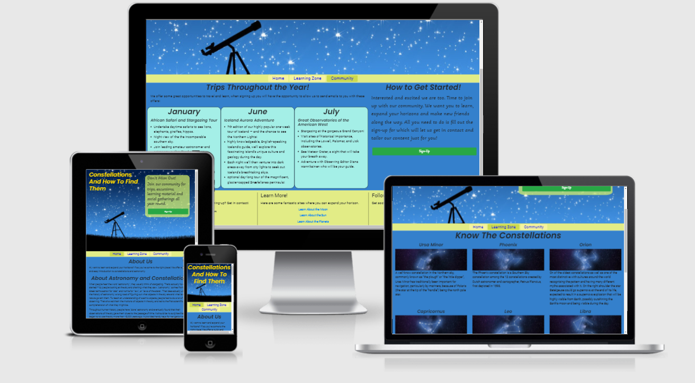

<h1 align="center">Looking at Stars</h1>

[View the live project here.](https://jason-philip.github.io/Looking-at-stars/)

A simple site to allow new and amateur astronomers to expand their knowledge of the night-sky and constellation, with secondary focus on encouraging the viewer to get involved and join the active community.

<h2 align="center"></h2>

## User Experience (UX)

-   ### User stories

    -   #### First Time Visitor Goals

        1. As a First Time Visitor, I want to easily understand the main purpose of the site.
        2. As a First Time Visitor, I want to be able to easily navigate throughout the site to find content.
        3. As a First Time Visitor, I want to interested by accessable astronomy content.
        4. As a First Time Visitor, I want to know my time will be well spent viewing well thoughout content.
    -   #### Returning Visitor Goals

        1. As a Returning Visitor, I want to better understand the trips being offerred.
        2. As a Returning Visitor, I want to find the best way to get in contact with the organisation with any questions I may have.
        3. As a Returning Visitor, I want to sign-up after considerring.
        4. As a Returning Visitor, I want to find new material to study.

    -   #### Frequent User Goals
        1. As a Frequent User, I want to check if there is any new learning content or scheaduled trips.
        2. As a Frequent User, I want to refresh on the informative information
        3. As a Frequent User, I want to sign up so that I am emailed any major updates and/or changes to the website or organisation.

-   ### Design
    -   #### Colour Scheme
        -   The two main colours used are yellow, the color of the stars and light blue taken from the main image using the eyedropper tool, so the color scheme is consistent.
    -   #### Typography
        -   Three fonts are used throughout the whole website: Roboto for the majority of content and smaller text, Poppins was used for Headers and titles and finally Akaya Kanadaka was used for sign-up areas to give a sense of personality and fun.  Sans Serif was the fallback font for Poppins and Roboto and cursive for Akaya Kanadaka in case for any reason the font isn't being imported into the site correctly. 
    -   #### Imagery
        -   To convey immediately the subject of the website, the main background image used on all pages show both star and observation of stars through the teloscope. As previously stated the color of the background image is used throughout.  Many constellation images of a similar type are used on the learning zone page, the similar but distinctive look allows the viewer to not get overwhelmed and easily conveys informationm; here the user can pick the image that interests them the most before reading the text.

*   ### Wireframes
    Wireframes were created at the start creating two responsive design for each page, allowing for a solid plan before development began.
    -   Home Page Wireframe - [Phone](assets/wireframes/home-mobile.png) -[Tablet](assets/wireframes/home-tablet.png)  -[Desktop](assets/wireframes/home-desktop.png) 

    -   Learning Zone Wireframes - [Phone](assets/wireframes/learningzone-phone.png) -[Tablet](assets/wireframes/learningzone-tablet.png)  -[Desktop](assets/wireframes/learningzone-desktop.png)
        
    -   Community Page Wireframe - [Phone](/workspace/Looking-at-stars/assets/wireframes/community-phone.png) -[Tablet](/workspace/Looking-at-stars/assets/wireframes/community-tablet.png)  -[Desktop](/workspace/Looking-at-stars/assets/wireframes/community-desktop.png)

## Features

-   Responsive on all device sizes

-   Interactive elements of video and sign-up

## Technologies Used

### Languages Used

-   [HTML5](https://en.wikipedia.org/wiki/HTML5)
-   [CSS3](https://en.wikipedia.org/wiki/Cascading_Style_Sheets)
-   [javascript](https://en.wikipedia.org/wiki/JavaScript) limited use

### Frameworks, Libraries & Programs Used

1. [Bootstrap 4.4.1:](https://getbootstrap.com/docs/4.4/getting-started/introduction/)
    - Bootstrap was used to assist with the responsiveness and styling of the website.
1. [Hover.css:](https://ianlunn.github.io/Hover/)
    - Hover.css was used on several buttons to indicate a clear action to the user.
1. [Google Fonts:](https://fonts.google.com/)
    - Google fonts were used to import the three main fonts into the style.css file which is used on all pages throughout the project.
1. [Font Awesome:](https://fontawesome.com/)
    - Font Awesome was used in the footer throughout the website to add icons for aesthetic and UX purposes.
1. [Git](https://git-scm.com/)
    - Git was used for version control by utilizing the Gitpod terminal to commit to Git and Push to GitHub.
1. [GitHub:](https://github.com/)
    - GitHub is used to store the projects code after being pushed from Git.
1. [Balsamiq:](https://balsamiq.com/)
    - Balsamiq was used to create the [wireframes](https://github.com/) during the design process.
1. [Ami.responsivedesing](http://ami.responsivedesign.is)
    - Am I responsive site was used as a presentation aid in this readme file.

## Testing

The W3C Markup Validator and W3C CSS Validator Services were used to validate every page of the project to ensure there were no syntax errors in the project.

-   [W3C Markup Validator](https://validator.w3.org/) - [Results](assets/images/html-valid.png)
-   [W3C CSS Validator](https://jigsaw.w3.org/css-validator/#validate_by_input) - [Results](assets/images/css-valid.png)
NB-The two errors in the css are not from my style.css file.

### Testing User Stories from User Experience (UX) Section

-   #### First Time Visitor Goals

    1. As a First Time Visitor, I want to easily understand the main purpose of the site.

        1. Upon entering the site, users are automatically greeted with a clean and easily readable navigation bar to go to the page of their choice. The main image clearly demonstrates the topic being coverred.
        2. The title clearly states the purpose of the site.
        3. The about us section again clearly spells out the purpose.
        4. The seconday purpose also is clear as the sign up call to action appears informing the user of this possibilty.

    2. As a First Time Visitor, I want to be able to easily navigate throughout the site to find content.

        1. The simple site is very easy to navigate using the centerred navbar, which has clear names as to the places they lead.
        2. For desktop and tablet users the sign up call to action is at the top of the page making it clear where to press if this is the desired course.
        3. The individual pages are kepts short and limited to a single field making sure the user is never confused about where the information they want is.

    3. As a First Time Visitor, I want to interested by accessable astronomy content.
        1. Once the purpose of the website is clear.  The next section on the home page gives a introduction to the constellation material so the user can get started immediately
        2. The first two pages of the site give priority to the astronomy information and learning material.  As shown by the position in the menu. 
        3. On the home page users will quickly see a video, and be reasuured that there is multiple learning media to consume, not just all writing.

    4. As a First Time Visitor, I want to know my time will be well spent viewing well thoughout content.
        1. The home page is broken down into multiple digestible chunks of paragraphs giving those who want to skim read to decide if this is for them a dircted route.  Each paragraph makes clear its purpose near the start.
        2. For those who trvel to the learning zone the layout clearly show what is available to learn with constellation titles.
        3. On the home page users will quickly see a video, and be reasuured that there is multiple learning media to consume, not just all writing.
-   #### Returning Visitor Goals

    1. As a Returning Visitor, I want to better understand the trips being offerred.

        1. In the community page the trips area takes priority with a new color and boxed layout introduced to draw the user to it.
        2. If the user feels more information is needed on the trip two options are presented.  Get in contact using the email in the footer, or sign up as the trips initial paragraph makes clear and get more detailed offers.

    2. As a Returning Visitor, I want to find the best way to get in contact with the organisation with any questions I may have.

        1. The footer gives multiple ways to get in contact on the left and right.  Email or social media, as is drawn by the icons.
        2. The sign up form states that the site will be in touch aftercompletion of the form.

    3. As a Returning Visitor, I want to sign-up after considerring.
        1. The sign up button can be found at the top of the screen so is easily accessible for users.
        2. Furthermore, as would be expected another signup is found in the community page with more detailed information of whats involed to encourage further action.

    4. As a Returning Visitor, I want to find new material to study.
        1. The footer includes suggestions for other astronomy topics along with a link to take you to them
        2. If there was new content it could be navigated to through the learning zone; where a user would expect it.
        3.  Links are included in the main text so that better understanding can be gained.
            

-   #### Frequent User Goals

    1. As a Frequent User, I want to check if there is any new learning content or scheaduled trips.

        1. The user would already be comfortable with the website layout and can easily navigate using the navbar to the correct page.

    2. As a Frequent User, I want to refresh on the informative information

        1. The video contains many terms which may be only nnoticed on multiple watches and will quickly enhance and refresh any lost knowledge.
        2. The learning zone offers quick recap on a large range of constellations.

    3. As a Frequent User, I want to sign up so that I am emailed any major updates and/or changes to the website or organisation.
        1. A frequent user will want to connect with all remaining outlets social media and email as well as signing up this is highlighted in the footer with icons.  

### Further Testing

-   The two primary places of testing were on developer tools on mozilla firefox and microsoft edge, using the element selector most positioning, margin and padding issues were tested here first.
-   The Website was tested on Google Chrome, Internet Explorer, and Safari browsers also.
-   The website was viewed on a variety of devices such as Desktop, Laptop, iPhone7, iPhone 8 & iPhoneX and resized from a large range of sizes in web developer tools.
-   A large amount of testing was done to ensure that all pages were linking correctly.
-   Friends and family members were asked to review the site and documentation to point out any bugs and/or user experience issues.

### Known Bugs

-   In mozilla firefox the preferred method of resizing the image {width: fit-content;} at smaller screens failed to work, requiering the alternative method of {width: 100%}.

### Interesting Issues Discovered and Addressed

-   When adding the form entire form acted as a link to instagram. This helped discover a flaw in the code that the annchor elements in the footer didn't have closing tags.  

-   When creating the bootstrap grid in the trips section, in an attempt to differentiate between the different month sections increasing the margin of a column caused the creation of a new row.  To avoid this a 1 px solid border was added to each colomn section and border-radius which created a nice seperation.

-   Initially the navigation menu's buttons were increased in size by incresing the size of the li (list element) padding.  Appearance wise this worked, however created a section of button that could be pressed without response.  A switch of the padding size from the li to a (anchor element) gfeatly improved UX with a easier to click nav button.

-   To center the video in a iframes element requiered the applying of {text-align:center} to a parent div called wrapper (as it wrapped around the iframe).
applying the text-align to the iframe using an element selector did ot work.

## Deployment

### GitHub Pages

The project was deployed to GitHub Pages using the following steps...

1. Log in to GitHub and locate the [GitHub Repository](https://github.com/)
2. At the top of the Repository (not top of page), locate the "Settings" Button on the menu.
    - Alternatively Click [Here](https://raw.githubusercontent.com/) for a GIF demonstrating the process starting from Step 2.
3. Scroll down the Settings page until you locate the "GitHub Pages" Section.
4. Under "Source", click the dropdown called "None" and select "Master Branch".
5. The page will automatically refresh.
6. Scroll back down through the page to locate the now published site [link](https://github.com) in the "GitHub Pages" section.

### Forking the GitHub Repository

By forking the GitHub Repository we make a copy of the original repository on our GitHub account to view and/or make changes without affecting the original repository by using the following steps...

1. Log in to GitHub and locate the [GitHub Repository](https://github.com/)
2. At the top of the Repository (not top of page) just above the "Settings" Button on the menu, locate the "Fork" Button.
3. You should now have a copy of the original repository in your GitHub account.

### Making a Local Clone

1. Log in to GitHub and locate the [GitHub Repository](https://github.com/)
2. Under the repository name, click "Clone or download".
3. To clone the repository using HTTPS, under "Clone with HTTPS", copy the link.
4. Open Git Bash
5. Change the current working directory to the location where you want the cloned directory to be made.
6. Type `git clone`, and then paste the URL you copied in Step 3.

```
$ git clone https://github.com/YOUR-USERNAME/YOUR-REPOSITORY
```

7. Press Enter. Your local clone will be created.

```
$ git clone https://github.com/YOUR-USERNAME/YOUR-REPOSITORY
> Cloning into `CI-Clone`...
> remote: Counting objects: 10, done.
> remote: Compressing objects: 100% (8/8), done.
> remove: Total 10 (delta 1), reused 10 (delta 1)
> Unpacking objects: 100% (10/10), done.
```

Click [Here](https://help.github.com/en/github/creating-cloning-and-archiving-repositories/cloning-a-repository#cloning-a-repository-to-github-desktop) to retrieve pictures for some of the buttons and more detailed explanations of the above process.

## Credits

### Code

-   The README.md is based off a template from code Institute.

-   The full-screen hero image code came from this [StackOverflow post](https://stackoverflow.com)

-   [Bootstrap4](https://getbootstrap.com/docs/4.4/getting-started/introduction/): Bootstrap Library used throughout the project mainly to make site responsive using the Bootstrap Grid System.

-   [W3schools](https://www.w3schools.com/) : Was used for the section of code to create the modal using JavaScript, which I am yet to learn fully.  Tutorial Found [Here](https://www.w3schools.com/howto/howto_css_modals.asp#:~:text=%20How%20To%20Create%20a%20Modal%20Box%20,fixed%3B%207%20Step%203%29%20Add%20JavaScript%3A%20More%20)

### Content

-   The teloscope_header_background.jpg was sourced from [Shutterstock](https://www.shutterstock.com/image-illustration/telescope-on-grass-under-stars-background-100899094)

-   All constellation jpgs were found and saved from [Star-name-Registery](https://star-name-registry.com/) 

-   Content and Information for constellation details and names were found at [Constellation-Guide](https://www.constellation-guide.com/) and [Nine-Planets](https://nineplanets.org/)

-   [Nasa](Also provided much of the information required to write the text for the home page)
### Media

-   The incredibly informative video on celestial sphere was produced and uploaded on youtube by [Kurdistan  Planetarium](https://www.youtube.com/embed/1Toya19H12w)

### Acknowledgements

-   My Mentor for continuous helpful feedback.

-   Tutor support at Code Institute for their support.

-   Student care for keeping in touch about deadlines.